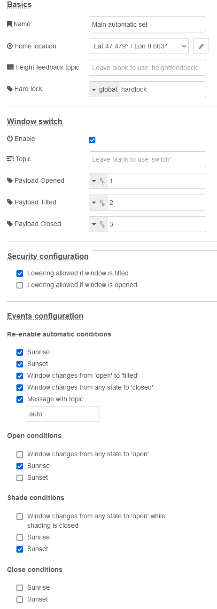

# Manual for "shading automatic node"
Options here affect automatic behavior of your blind.

## Basics

### Name
Enter a name to identify the configuration set. Especially when using different configuration sets, this may be crucial. If you leave it blank, "Shading main configuration" will be shown.

## Blind configuration
