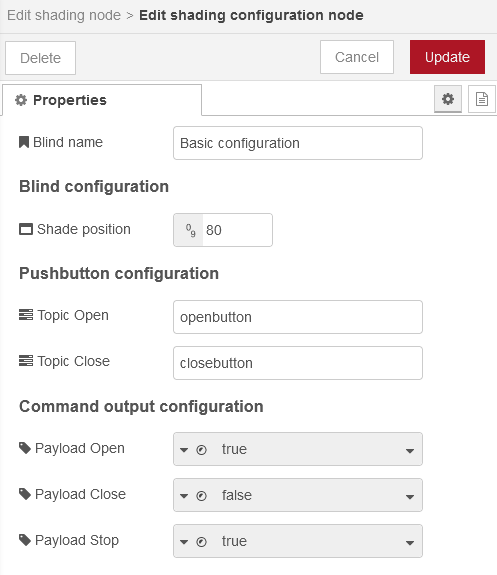
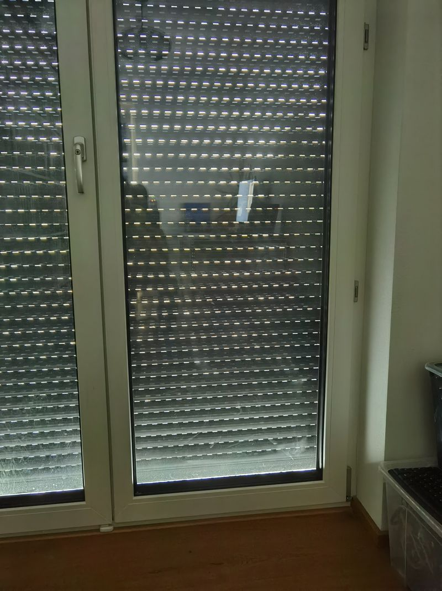

# Manual for "shading configuration node"
Here you make basic settings affecting the behavior of your blind. Create this configuration set and use it then for other shading nodes.

## Basics

### Name
This is required. Enter a name to identify the configuration set. Espectially when using different configuration sets, this is crucial.

## Blind configuration

### Shade position
This must be a number between 0 and 100, where 0 is open and 100 is closed position. If you have a shutter, you may want to have it moving not completely down but not close it completely. Moving to this value will leave the gaps open in your blind.

