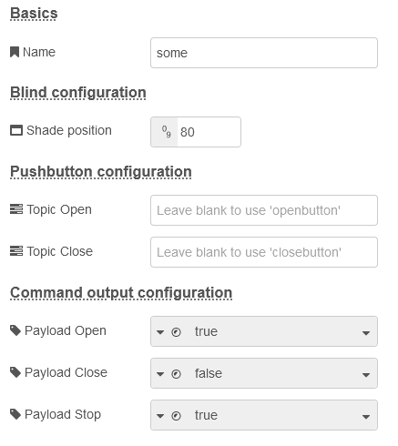

# Manual for "shading configuration node"
Settings here affect the behavior of your blind. Create this set of configuration and use it for other shading nodes.

## Basics

### Name
Enter a name to identify the configuration set. Especially when using different configuration sets, this may be crucial. If you leave it blank, "Shading main configuration" will be shown.

## Blind configuration

### Shade position
This must be a number between 0 and 100, where 0 is open and 100 is closed position. If you have a shutter, you may want to have it moving not completely down but not close it completely. Moving to this value will leave the gaps open in your blind, like this:

## Pushbutton configuration
If you have pushbuttons (i.e. on your wall, in your web interface, ...), **they MUST send as payload a boolean TRUE if pressed and a boolean FALSE if released**. The topic of these messages must meet wither "openbutton" and "closebutton", but you can modify the topics below for both buttons.

### Topic Open
This is the topic expected within the message for a open command. It must be part of both bushed and released messages.

### Topic Open
This is the topic expected within the message for a close command. It must be part of both bushed and released messages.