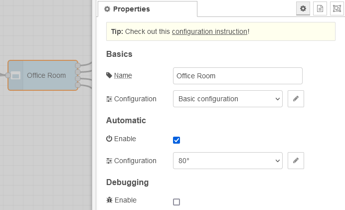

# Manual for "shading node"
Here you find some very basic and blind specific settings. Create a configuraiton set under Basics -> Configuration, which you can re-use with oder blinds.

## Basics

### Name
If you wish, give the individual node a name. It will be displayed on the drawboard. If you leave this field empty, "Shading" will be displayed there. The value you enter here will also be used in any logging or debugging, so sou might be interested to name the node recognizable.

### Configuration
Some serious magic hides behind this configuration. Create a set of functionalities and use this with other shading nodes. [Read this](configuration.md) to learn more.

## Automatic

### Enable
If you wish only to control your blind only manually, leave this option disabled. If you prefer to have some automatic behavior, enable it. [Read this](automatic.md) to learn more.

### Configuration
This field is only visible, if automatic is enabled. Create or choose a configuration set, which may me shared together with other shading nodes. The name of the configuration set optionally can be defined in the configuration itself.

## Debugging

### Enable
Enabling this option results in receiving messages in the debug pane as well as in the console. You should not have this enabled permanently and with more nodes as it may confuse things. This option may be removed at some later time.