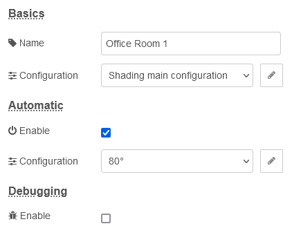

# Manual for the shading node
This interface provides you with only some very basic settings.

## Basics

### Name
If you wish, give the individual node a name. It will be displayed on the drawboard. If you leave this field empty, "Shading" will be displayed. The value you enter here will also be used in any logging or debugging, so sou might seriously be interested to name the node recognizable.

### Configuration
Some serious magic hides behind this configuration. [Read this](configuration.md) to learn more.

## Automatic

### Enable
If you wish only to control your blind only manually, leave this option disabled. If you prefer to have some automatic behavior, enable it. [Read this](automatic.md) to learn more.

### Configuration
This field is only visible, if automatic is enabled. Choose here a configuration set optionally used together with other shading nodes. The name of the configuration set can be defined in the configuration itself. If left blank, the orientation value in degrees will be used instead.

## Debugging

### Enable
Enabling this option is really not recommended, unless you know what you are doing or simply don't care. The result will be lots of debugging messages on the console as well as in the debug view of Node-RED.